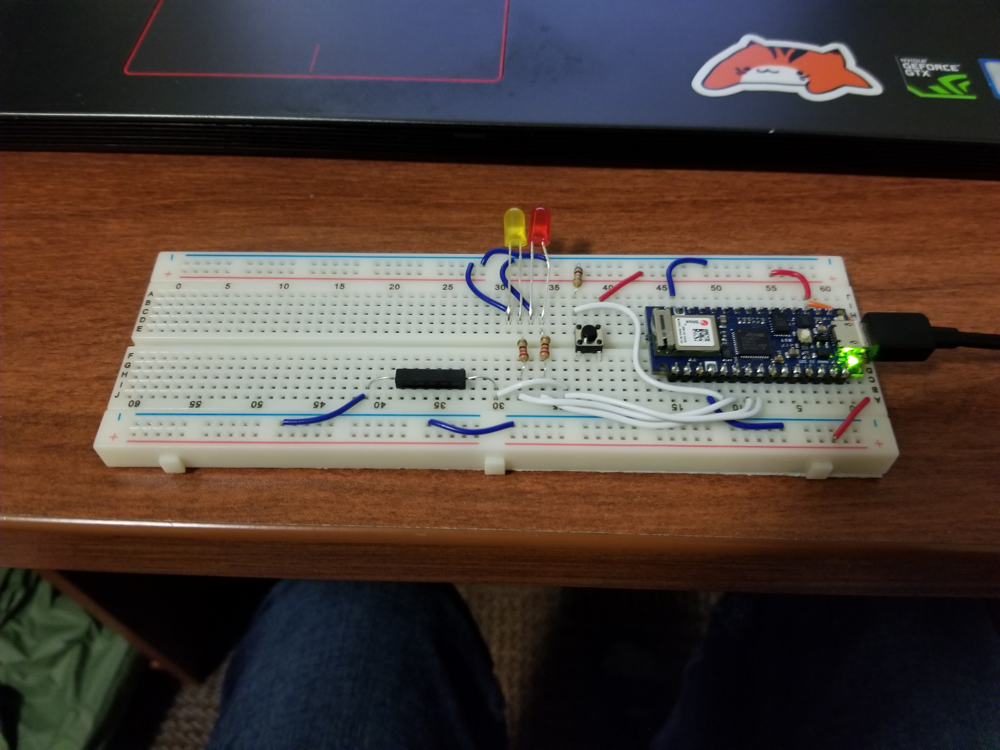
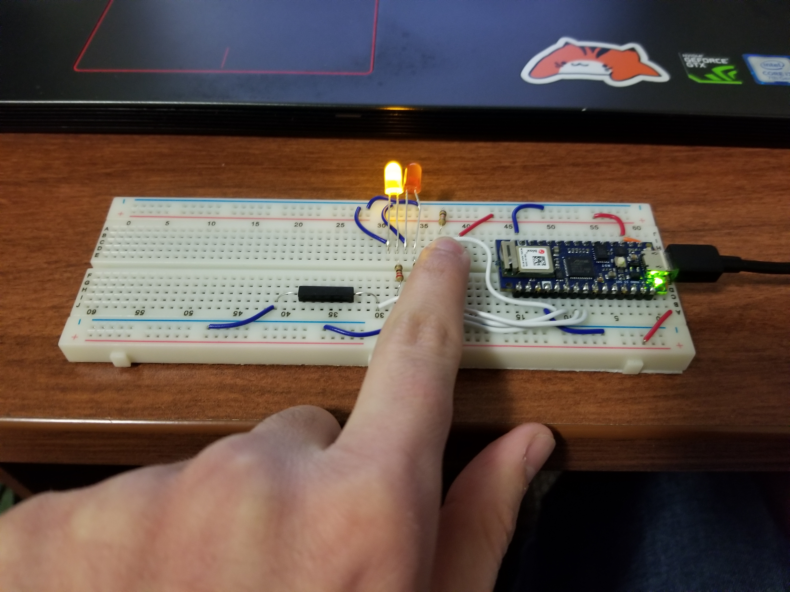
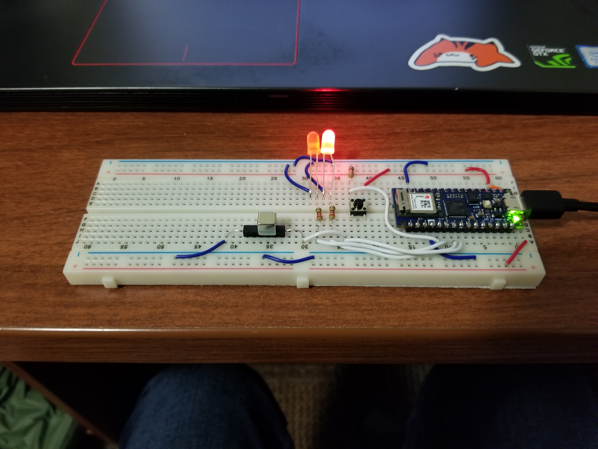
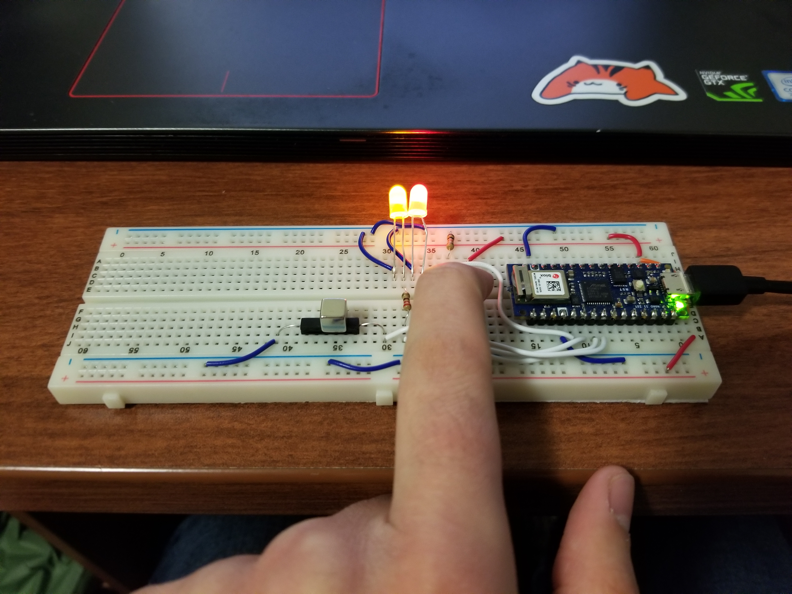

# Digital Ins and Outs: Adding a Reed Switch

 Breadboard setup with a Bongo Ritchie spectator.

## What is a Reed Switch?
For this assignment, I decided to add a reed switch from my [Sparkfun Essential Sensors Kit](https://www.sparkfun.com/products/12862). Reed switches are magnetic switches that consist of two ferrous rods. When exposed to a magnetic field (such as magnets or strong electical currents), the ferrous rods magnetize and connect to each other, closing the connection.

## How does it work?
All four inputs and outputs (button, two LEDs, and the reed switch) are all hooked up to the digital pins of the Arduino, with the button set to INPUT, the LEDs set to OUTPUT, and the reed switch set to INPUT_PULLUP (utilizing the [Arduino's built in resistors](https://www.arduino.cc/en/Tutorial/Foundations/DigitalPins)). When the button is pressed, the yellow light turns on. When the reed switch is activated, the red light turns on. Code can be found [here](../code/digital-ins-and-outs.ino).
  

 When the button is pressed down, the yellow LED turns on.
  

 When the reed switch has a magnet near it, the red LED turns on.
  

 Both switches activated simultaneously.
  

## References
[Sparkfun - Reed Switch Hookup Guide](https://learn.sparkfun.com/tutorials/reed-switch-hookup-guide)
 
[Arduino - Digital Pins](https://www.arduino.cc/en/Tutorial/Foundations/DigitalPins)

Written by Chris Hambacher, 2021.