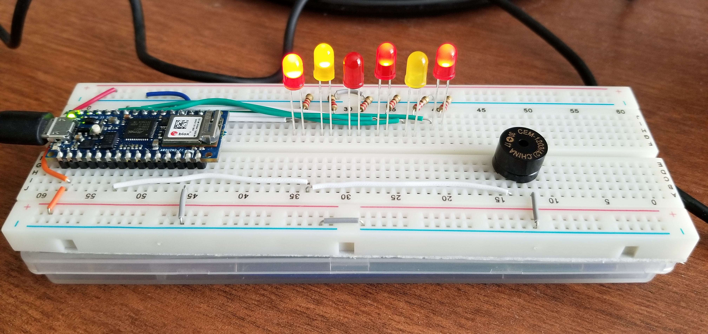
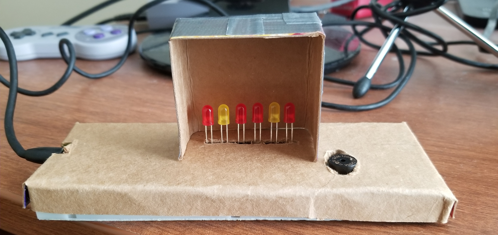
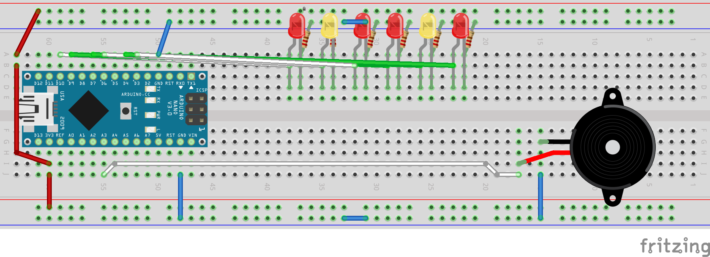

# Fireplace - Final Project by Breanna and Chris

## Video Demonstration

Our idea was to create a serene scene: it's a dark, rainy night, and you are sitting in the reading room with a glass of ~~whiskey~~ tea or milk, with a fireplace gently glowing, and some relaxing tunes playing. In our case, this means using a sensor to detect if someone is "in the room" by using a DIY pressure sensor to see if a cup is placed on a coaster, which in turn toggles the music. We also wanted the fire to become a little brighter whenever a page of a book is turned, so we  went with a Piezo sensor tucked in the pages.

## The Fireplace

To simulate a fireplace, we used six LEDs, two yellow and four red. The LEDs are randomly flashing on a timer. When the board gets a read from the server, the LEDs will flash brighter, and gradually get dimmer until it reaches the initial brightness.

The music comes from a Piezo buzzer, which has issues. The first issue that we ran into is that volume control doesn't exist for this board. The third party Volume library for Arduino only works with AVR boards, and the Nano 33 IoT has an ARM processor, not an AVR processor. The song we originally went with was of choice was Professor Layton's Theme from Professor Layton and the Curious Village, but after listening to it, we decided to switch to Canon in D, as with only one channel, Canon in D sound so much better (see all the songs here: [https://github.com/robsoncouto/arduino-songs](https://github.com/robsoncouto/arduino-songs)).

I had very limited materials to dress the board with, so I had to use cardboard, duct tape, and scissors. One of the main difficulties is that I didn't have a ruler, so my cuts were pretty inaccurate. Trying to feed the LEDs through the hole was a pain, as I had to lift up the cardboard and look through the gap to get the LEDs in the breadboard. Also, I had to rewire the Piezo speaker in order to get it to fit in the hole I cut.

## Code and Fritzing
The code for this was also a hassle. Since we needed data from the server to determine the actions of the fireplace, we needed to wait for data from the server before running the update. If there was asynchronous code execution capabilities, the code would have been a lot better. Also, for some reason the connection to the server would randomly drop for seconds at a time, causing breaks in the music. It's possible that using frame timers would have made it better, but the music code didn't use them, and trying to refactor it is more energy than I had.

[Link to code folder](../code/fireplace/)

If you would like to see the other half of the project, check out Breanna blog post [here](https://github.com/B-Hen/IGME-470-Blog/wiki/If-These-Walls-Could-Talk-Final-Project).