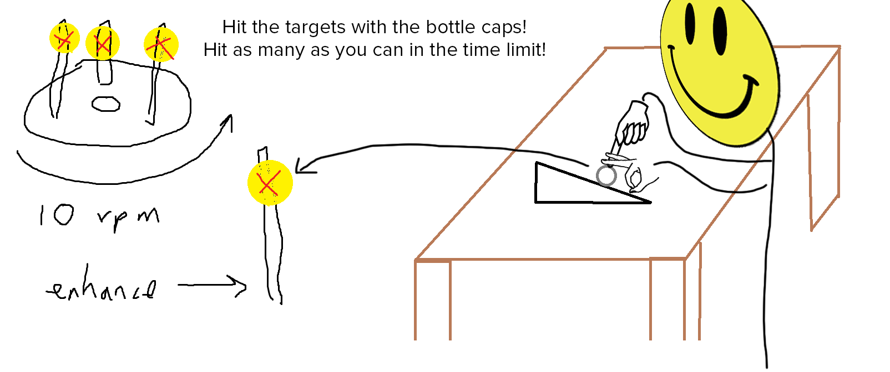

# Horseshoes but Epic - By Breanna, Chris, and Dominic

Our game idea was to make the game of horseshoes, but more epic. There is a CD with popsicle sticks TM attached to it, with Piezo sensors attached to the sticks. The player is at a table with a ramp on it, which is at a regulation one yard away from the CD (or one meter, if you are not epic). The player attempts to flick water bottle caps at the Piezo sensors, trying to hit as many as they can within the 30 second time limit. The player that hits the most wins!

This is an accurate representation of what the game would look like.

