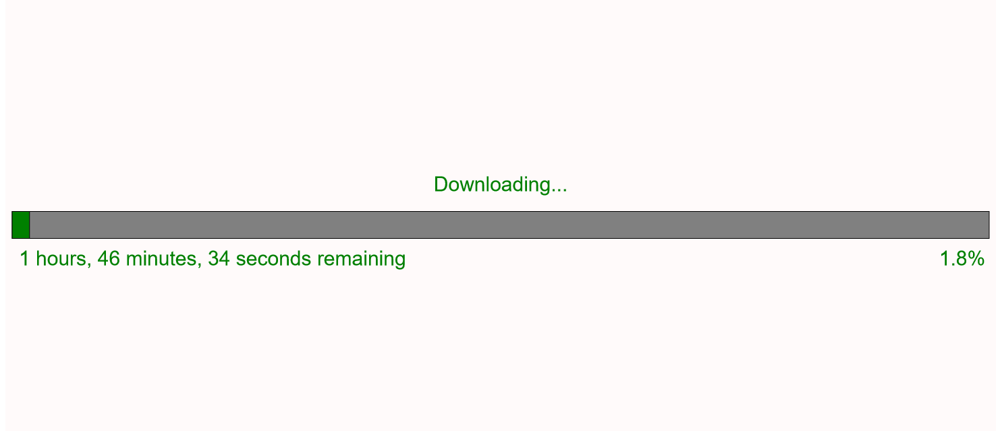
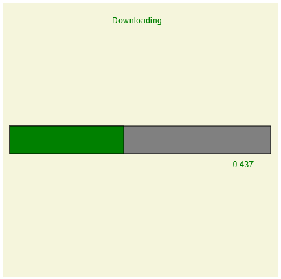

# The Running Man - By Breanna and Chris

## Demo Video
[](https://www.youtube.com/watch?v=rk1l2J1ecu8)

<br>

---

<br>

## Original Plan - Loading Bar of Despair
For this project, we initially wanted to invoke some more negative emotions, such as despair and frustration. And what better way of doing this than a glitchy stalling file downloading bar? Relive the experience of downloading Taylor Swift songs off of Napster with inconsistent DSL internet!



The loading bar has a relatively high chance to stall for an extended period of time. However, if the user exhibits frustration through noise (e.g. swearing, groaning, or sighing), the stall time is reduced. If the user exhibits frustration through physical means (e.g. hitting or tapping the sensor), the stall time is reduced. Through sheer willpower, the user can get the bar to continue moving, until the download eventually fails because your ISP decided to cut your internet for a bit.

## My Part
My part was mostly dealing with the backend JS code, as I don't have the DF robot sound sensor. The project utilizes P5, which we were not familiar with before this project, but since it's really similar to canvas, it wasn't too hard to learn. The backend logic was pretty straight forward: if it was not stalled, increase the bar by an increment every frame, and roll a chance for it to stall. If it is stalled, record user inputs to reduce stall time, and increase the time remaining by a multiplier after a certain number of frames (stall time) has passed. Clear the canvas and redraw all of the text and boxes each frame. This is what the first iteration of the download bar looked like:



Brianna worked on the physical component, both with the breadboard and the Arduino code. She also did some of the creative aspects of the p5 code (such as background color changing depending on noise), and made the video. Check out her blog post here: <a href="https://github.com/B-Hen/IGME-470-Blog/wiki/From-Loading-Bar-of-Despair-to-Running-Man">From Loading Bar of Despair to Running Man</a>

## Why we switched
We had this project mostly done a week before the deadline, but during class on Monday, we realized that while our project interacted with the sensors, we couldn't figure out what a physical version of this would look like. If it was just a random loading bar, that doesn't invoke the same emotions. The user needs to be waiting for something. Because of this, we decided to pivot to a different idea, one which wouldn't require too much more coding: the running man.

<br>

--- 

<br>

## Final Plan - The Running Man
For this iteration, we wanted to invoke feelings of excitement, compassion, and camaraderie. This gave us the idea of a runner, who occasionally stops, and through crowd encouragement, would continue running until they reach the end. Physically, this would involve a long stretch of wall (or could be a large circular room) with a long winding slot cut out of it. The wall would be painted with some form of running scenery, maybe a forest or a city. The runner would be attached to a metal bar that moves along the slot using some form of belt. The runner itself would have servos attached to the joints, in order to simulate running and stopping. When the runner stops to take a break, the crowd can get them to continue through cheering and stomping.


## Transitioning the Code
Thankfully, our new idea could utilize the code we already wrote, as a loading bar is a way of representing percent completion. The hardest part was actually creating the runner and joints, as it was all made through p5 primitives. Here's an example of what the code for drawing one arm looks like:
```js
// Arm 1 inner
push();
rectMode(CORNER);

angle = 60 + angleChange;
translate(middleX + 20, middleY - 45);
rotate(angle);
translate(-middleX - 20, -middleY + 45);
rect(middleX + 20, middleY - 45, 60, 25, 20);

angle = 50 + angleChange;
translate(middleX + 55, middleY - 30);
rotate(angle);
translate(-middleX - 55, -middleY + 30);
rect(middleX + 55, middleY - 30, 25, -60, 20);
pop();
```

If the joints rotate too much, they'll detach from the body, which is not ideal, but for our demo purposes, it works (in a physical setting, since the servo would represent the joint, this wouldn't be an issue). Instead of having the background just change color, Brianna coded it such that images of people cheering or images of people stomping would appear (to simulate people around you doing the same). Also, when the runner eventually reaches the end, an image of people clapping would appear.

## Conclusion
Overall, the project was a success. It can create certain emotions utilizing components and a screen. Granted, if we had the budget and time, it would be a much more compelling experience, but it was still good either way. Coding the assignment in p5 was a nice challenge, as neither of us have used p5 before (but we are both familiar with HTML canvas).

### Links
- [Arduino Code](https://create.arduino.cc/editor/b_hen/c9b68948-cf11-49b0-9593-7fd6104fdbc2/preview)
- [Demo Website](../code/loading-bar/)
- [Brianna's Blog](https://github.com/B-Hen/IGME-470-Blog/wiki/From-Loading-Bar-of-Despair-to-Running-Man)
