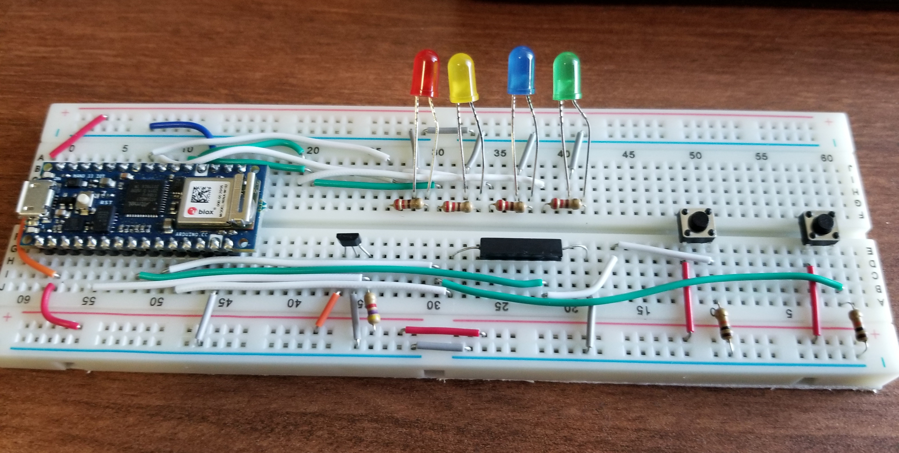
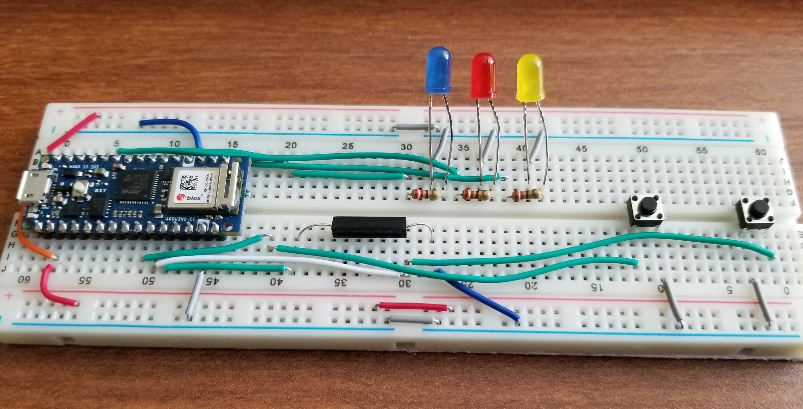
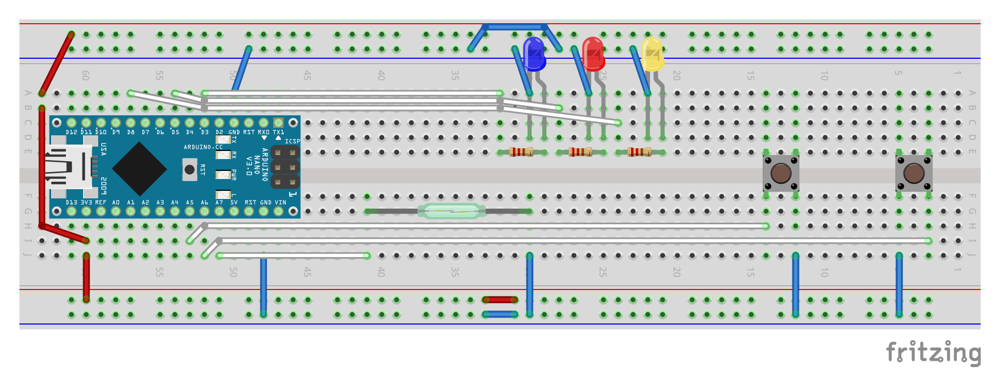

# Simon Says
## Video Demonstration

## Original Plan
The original plan for this project was to make a Simon Says game with four inputs and four LEDs. The LEDs would flash in a certain order, and the player would have to recreate it. One issue I ran into along the way was space on the breadboard, as the buttons need to go across the breadboard, and with four LEDs, that is hard to do. Since I only have two buttons, I needed two other sensors, so I went with the two that should play nice together, which is the reed switch and the hall sensor (both react to magnets).

## Issues I ran into
One thing I didn't realize is that the hall sensor is a latch: once you activate it, you need to hold a magnet on the other side to deactivate it. This by itself wouldn't be too big of an issue, because you can power cycle it from the Arduino to make it into a pseudo switch. However, as it turns out, the reed switch is very sensitive, so holding a magnet at the hall sensor would also trigger the reed. Since I wasn't working with much room, I made the executive decision to cut the hall sensor and just have three inputs.

Another problem I ran into was with the middle button. For some reason, no matter what I tried, it refused to properly work with the pulldown resistor, and would always output HIGH regardless if it was pressed or not. The workaround I went with was to just use the built in pullup resistor in the Arduino, as that is the only thing that I tried that allowed the button to work. Since both my reed switch and first button were using the pullup, I figured I'd have my second button also use the pullup.

## Gameplay
When powered, all three lights will be lit, and will remain lit until the user activates one of the inputs. After the first input, a pattern will play, starting with three lights. The user can take their time to repeat the pattern, as there is no time limit for inputs. If the user puts in the same pattern that was shown to them, all three lights flash three times, and then plays the next pattern, with an extra light added. There is no end to the game, but there is a maximum pattern length of 20 (once a player hits 20, it'll let the player play indefinitely with a pattern of 20 lights). If the player puts in a wrong input, all three lights will light up, and turn off one after another until they are all off. To replay the game, press the RST button on the Arduino.

### Before removing the hall sensor:

### Final design:

### Fritzing diagram:

## Code can be found [here.](../code/simon-says.ino)